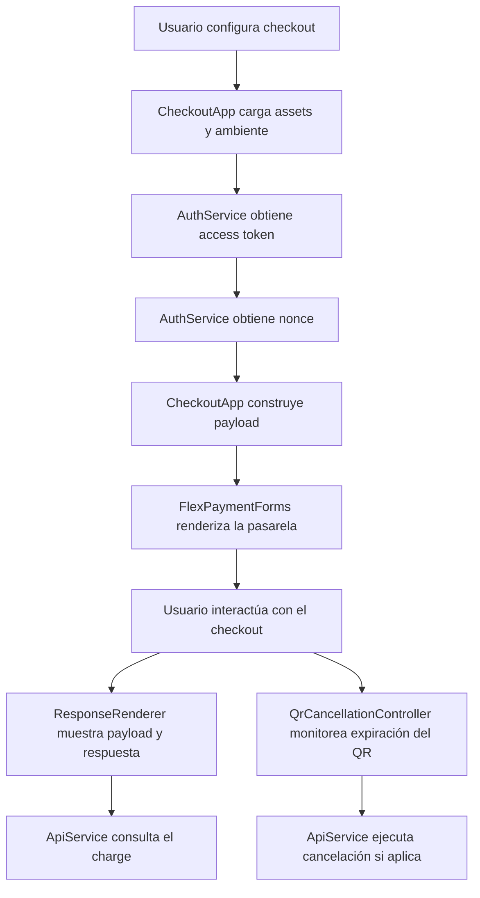

# Demo de Integración Checkout Flex

> Documento generado automáticamente desde la configuración actual del proyecto.
> Si cambias flujos, métodos, ambientes o utilidades globales, ejecuta:
>
> ```bash
> node scripts/generate-readme.mjs
> ```

## Resumen Ejecutivo

Este proyecto es un demo frontend de checkout orientado a integraciones de pago. Su objetivo es mostrar, de forma clara y usable, cómo abrir una pasarela en distintos formatos, construir el payload de cobro, obtener token y nonce, inspeccionar respuestas, consultar charges y gestionar el ciclo de vida del flujo QR.

En menos de 30 segundos este repositorio busca transmitir:

- Qué sé hacer: integraciones frontend para pasarelas de pago con enfoque funcional y técnico.
- En qué me especializo: flujos de checkout, observabilidad, configuración por ambiente y experiencia operativa.
- Qué problema resuelve: acelerar pruebas, demos técnicas y validación de comportamientos reales en integraciones de pago.
- Qué tan listo está para escenarios reales: separación de responsabilidades, manejo de errores, trazabilidad y limpieza de estado entre solicitudes.

## Problema de Negocio

Cuando un equipo integra una pasarela de pago, no solo necesita “ver un formulario”. Necesita una herramienta que permita probar rápidamente diferentes combinaciones de monto, moneda, método de pago, ambiente y credenciales; además de inspeccionar respuestas y reproducir comportamientos como expiración de QR o reinicio de una transacción.

Este demo resuelve ese problema ofreciendo un entorno liviano y reutilizable para:

- Soportar pruebas funcionales de checkout.
- Reducir el tiempo de validación durante onboarding o QA.
- Mostrar a negocio y a equipos técnicos qué entra, qué se envía y qué retorna la integración.
- Reiniciar el flujo sin arrastrar información vieja de una operación anterior.

## Casos de Uso Reales

- Demo de integración para onboarding con una pasarela.
- Sandbox frontend para QA de métodos de pago.
- Evidencia de portafolio para fintech, ecommerce o medios de pago.
- Validación operativa de comportamientos de checkout multifujo.

## Información Dinámica del Proyecto

Esta sección se genera desde `index.html` y `vff_oop.js`.

- Flujos detectados: 3
- Monto por defecto: `100`
- Monedas habilitadas: Soles (PEN) `PEN`, Dolares (USD) `USD`
- Métodos detectados: 6
- Expiración actual del QR: 1 minuto(s)
- Funciones globales expuestas: `abrirFormularioNormal()`, `abrirModal()`, `abrirFormularioExpandido()`, `cerrarModal()`, `volverAlInicio()`, `forceQrCancellationNow()`, `printQrExpiration()`, `printQrCancellation()`, `vffDebugState()`

### Flujos Disponibles

- Formulario normal
- Pop up
- Formulario expandido

### Métodos de Pago Habilitables

- Tarjeta `CARD`
- Yape `YAPE`
- QR `QR`
- Pago Efectivo `PAGOEFECTIVO`
- Cuotealo `CUOTEALO`
- Cuotealo `BANK_TRANSFER`

### Ambientes Configurados

| Ambiente | Auth Base URL | API Base URL | Cancel API Base URL |
| --- | --- | --- | --- |
| `tst` | `https://auth.preprod.alignet.io` | `https://api.dev.alignet.io` | `https://api.preprod.alignet.io` |
| `prod` | `https://auth.alignet.io` | `https://api.alignet.io` | `https://api.alignet.io` |

## Qué Hace Este Proyecto

- Abre el checkout en tres presentaciones distintas.
- Solicita access token y nonce antes de iniciar la pasarela.
- Construye el payload de pago de forma controlada.
- Permite visualizar la respuesta de la transacción.
- Permite inspeccionar el payload enviado.
- Consulta el charge asociado desde la UI.
- Detecta selección de QR, calcula expiración y programa cancelación.
- Limpia el estado runtime para evitar reutilizar datos de una solicitud anterior.

## Arquitectura

La lógica principal vive en [vff_oop.js](/Users/macbookprotouch/Documents/ALIGNET/example-flex-vff/EJEMPLO_VFF_FLEX/vff_oop.js) y está organizada por responsabilidades:

- `Utils`: Utilidades para formateo, serialización segura y helpers de soporte.
- `Logger`: Herramientas de trazabilidad y debug del estado visual.
- `NoticeService`: Manejo de mensajes de expiración y cancelación del flujo QR.
- `AuthService`: Obtención de access token y nonce antes de abrir el checkout.
- `ApiService`: Consulta de charge y ejecución de cancelación QR.
- `ResponseRenderer`: Render de payload, respuesta y consulta API dentro del demo.
- `QrCancellationController`: Control del ciclo de vida del QR: selección, expiración y cancelación.
- `CheckoutApp`: Orquestador principal del checkout, configuración, carga de assets y reinicio de estado.

## Flujo del Sistema



### Entrada -> Proceso -> Salida

1. Entrada
   - Credenciales del merchant
   - Monto
   - Moneda
   - Métodos de pago
   - Tipo de presentación del checkout

2. Proceso
   - Selección de ambiente y carga de assets
   - Solicitud de token y nonce
   - Construcción del payload
   - Inicialización del formulario Flex
   - Manejo de eventos de éxito, cancelación o error
   - Consulta opcional del charge
   - Gestión de expiración/cancelación para QR

3. Salida
   - Checkout funcional
   - Payload visible
   - Respuesta transaccional visible
   - Consulta API visible
   - Notificaciones de expiración y cancelación QR

## Señales de Preparación para Producción

Aunque este repositorio es un demo, incorpora varios criterios que sí importan en un entorno real:

- Separación clara por servicios y orquestación.
- Cambio de ambiente entre `tst` y `prod`.
- Trazabilidad mediante utilidades de debug.
- Control explícito de token y nonce.
- Consulta y cancelación vía capa de API dedicada.
- Reinicio limpio del flujo para evitar arrastre de estado.
- Generación de `merchant_operation_number` nuevo por solicitud.

## Limitaciones Actuales

Este proyecto está pensado como demo de integración y portafolio. Para mantenerlo autocontenido, las credenciales viven en frontend.

Si se llevara a un entorno real, lo siguiente debería pasar a backend:

- Manejo de secretos
- Solicitud de token
- Solicitud de nonce
- Trazabilidad persistente
- Controles de acceso y monitoreo

## Estructura del Proyecto

```txt
.nojekyll
index.html
Pay-Me.png
scripts/
  generate-readme.mjs
vff_oop.js
```

Archivos principales:

- [index.html](/Users/macbookprotouch/Documents/ALIGNET/example-flex-vff/EJEMPLO_VFF_FLEX/index.html): UI, layout y puntos de entrada de interacción.
- [vff_oop.js](/Users/macbookprotouch/Documents/ALIGNET/example-flex-vff/EJEMPLO_VFF_FLEX/vff_oop.js): servicios, lógica de checkout, control QR y estado runtime.
- [scripts/generate-readme.mjs](/Users/macbookprotouch/Documents/ALIGNET/example-flex-vff/EJEMPLO_VFF_FLEX/scripts/generate-readme.mjs): generador del README basado en la configuración real del proyecto.

## Stack Técnico

- HTML5
- CSS3
- JavaScript Vanilla
- Flex Payment Forms
- Fetch API del navegador
- localStorage para perfiles de credenciales

## Cómo Ejecutarlo

No requiere build step ni dependencias del proyecto.

### Opción 1

Abrir directamente [index.html](/Users/macbookprotouch/Documents/ALIGNET/example-flex-vff/EJEMPLO_VFF_FLEX/index.html) en el navegador.

### Opción 2

Levantar un servidor estático simple:

```bash
cd /Users/macbookprotouch/Documents/ALIGNET/example-flex-vff/EJEMPLO_VFF_FLEX
python3 -m http.server 8080
```

Luego abrir:

```txt
http://localhost:8080
```

## Cómo Usarlo

1. Configura monto y moneda.
2. Marca los métodos de pago a habilitar.
3. Elige el tipo de flujo.
4. Si lo necesitas, cambia ambiente o credenciales desde el panel seguro.
5. Ejecuta la transacción de prueba.
6. Revisa la respuesta, el payload y la consulta del charge.

## Ejemplo de Payload

```json
{
  "action": "authorize",
  "channel": "ecommerce",
  "merchant_code": "tu-merchant-code",
  "merchant_operation_number": "12345678901",
  "payment_method": {},
  "payment_details": {
    "amount": "100",
    "currency": "604",
    "billing": {
      "first_name": "Peter",
      "last_name": "Kukurelo",
      "email": "peter.kukurelo@pay-me.com"
    }
  }
}
```

## Utilidades para Demo y Debug

Desde la consola del navegador:

- `abrirFormularioNormal()`
- `abrirModal()`
- `abrirFormularioExpandido()`
- `cerrarModal()`
- `volverAlInicio()`
- `forceQrCancellationNow()`
- `printQrExpiration()`
- `printQrCancellation()`
- `vffDebugState()`

## Valor para Portafolio

Este repositorio no solo enseña una interfaz. Enseña criterio de integración:

- Traducción de una necesidad de negocio a un flujo usable.
- Separación entre UI, autenticación, consumo API y control del checkout.
- Capacidad de diagnóstico y observabilidad.
- Manejo del estado para pruebas repetibles.

Eso lo hace especialmente útil para roles orientados a ecommerce, fintech, integraciones o plataformas de pago.

## Mejoras Siguientes

- Mover autenticación y secretos a backend.
- Agregar screenshots o GIFs por flujo.
- Incorporar pruebas automáticas para payload y reset de estado.
- Mejorar el feedback visual de errores API.
- Agregar pipeline de despliegue para demo pública.
